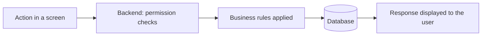

# Project overview and technology and business assessment

This document contains English translations of the two previous responses in the conversation, in their original order. Links to project files are adapted to this document's location.

Context: these responses reflect the exploration on 2026-09-18. They are an overview and
an advisory opinion, not engineering instructions or an approved product plan. Current
delivery status and decisions belong to [ERP_ROADMAP.md](architecture/ERP_ROADMAP.md)
and the relevant design notes. The recommendations below do not change the agreed phase
order, commercial tiers, AI decisions or source-license offering; the subscription example
is illustrative. Consult [CLAUDE.md](../CLAUDE.md) for the development workflow.

## 1. Project overview and operation

**Your project is a platform for managing a school or university with multiple campuses.** Its purpose is to bring academic administration, teachers, students, finances, documents and communication with families together in one place.

I explored the backend code and its documentation. Here is how I understand it, in simple terms.

**The current directory contains the application's engine.** It records information, checks permissions, calculates results and responds to requests from the user interfaces.

The complete platform is organized into four parts:

| Part | Its role |
|---|---|
| **Public portal** | Present programs and collect pre-registrations. |
| **Management interface** | Provide workspaces for administrators, teachers, students, parents and other users. |
| **Backend — this project** | Apply rules and manage shared data. |
| **Artificial intelligence service** | Provide an assistant, search documents and help interpret data. |

These parts live in separate projects. The backend connects them.

**Specifically, the code covers:**

- **Academic organization:** campuses, departments, levels, classes, subjects and a course catalog.
- **People:** students, teachers, parents, staff, mentors and partners.
- **Academic activities:** schedules, attendance, grades, report cards and online exams.
- **Finances:** fees due, recorded payments, balances, PDF receipts, income and expenses.
- **Documents:** creation, organization, versions, publication and sharing.
- **Communication:** announcements, in-app notifications and email.
- **Recruitment:** pre-registration, applicant tracking and commissions for partners who bring in enrollments.

There is also a timetable generator that takes teachers, classes, rooms and availability constraints into account.

**To understand how it works, imagine a student's journey.**

1. She discovers a program on the public portal and completes a pre-registration form. Her application enters the list of candidates to follow up with.
2. The administration processes her application, creates her student record and assigns her to a campus and class.
3. She activates her account using a link or code, then chooses her password.
4. She views her academic information. Teachers record attendance and grades.
5. Results go through **draft, submission and publication** stages. Published results feed into report cards; parents can view their children's reports.
6. The administration records fees and payments. The student can check her balance and download receipts. Automated jobs handle payment due-date reminders.

**One part of this journey remains unfinished:** changing an applicant's status to "enrolled" does not yet automatically create the student record. The code changes the status and may trigger a partner commission. Automatic student creation is among the remaining work items.

**Each user should see only what concerns them.** Directors and administrators can oversee multiple campuses. A campus manager works within their institution; a student accesses their own information; a parent follows their children. A partner should access only their own applicants and commissions.

The project also supports different commercial plans: features can be available, read-only or hidden depending on the campus.

**Technically, an action follows this path:**

The backend uses **Node.js and Express**, and stores data in **MongoDB**. Its code is organized into business modules in [modules](../modules). [app.js](../app.js) organizes the endpoints; [server.js](../server.js) starts the server, database connection and automated jobs.

**The project already has a substantial foundation, but some workflows remain incomplete.** Besides converting applicants into students, the [roadmap](architecture/ERP_ROADMAP.md) mentions finishing WhatsApp integration, strengthening authentication management and expanding tests. AI has a gateway in this backend, but requires its separate service and configuration.

My analysis covers the code and documents: I did not start the application or run tests, so I cannot confirm that all these workflows currently work end to end.

## 2. Technology, business and African market assessment

**My honest opinion: this project could become a viable business, but its technical breadth currently exceeds the available evidence of its commercial maturity.** The main risk is continuing to build a comprehensive, costly-to-maintain application before identifying exactly which institutions will pay and why they will stay.

My assessment is based on the code and documentation reviewed, along with a few market sources. I have not audited production behavior or seen your revenue, customers or their usage.

**Technologically, the foundations are coherent.**

Node.js, Express and MongoDB can support this product. The business module structure, separation of data access, per-campus controls, approval workflows and presence of tests show real architectural work.

The choice of a main backend organized into modules seems appropriate. I would keep this structure: multiplying independent services would increase deployment and troubleshooting difficulties.

If I were starting from scratch, I would probably favor PostgreSQL for such a relational domain: students, enrollments, classes, grades, debts and payments. **But I would not fund a migration now without a measured problem.** On its own, it would bring neither customers nor better adoption.

What concerns me more:

- **The maintenance surface is broad.** Exams, finances, documents, AI, partners and timetables could each become a complex product.
- **Overall reliability still needs to be demonstrated.** Unit tests do not prove that the start of a school year, an end-of-term process or a day of payment collection will run correctly.
- **Operations remain a work item in the documentation.** Restorable backups, monitoring, incident recovery and access revocation need verification before a substantial rollout.
- **Some functions exist without the business workflow being complete.** Converting an applicant into a student is a concrete example.

I would therefore describe the project as a **substantial application foundation whose operational maturity still needs to be proven**. The README's "production-ready" wording does not establish that maturity.

**From a business perspective, the positioning is too broad.**

"Manage all education, with AI, for Africa" provides a direction, but remains too vague to guide sales.

A primary school, a vocational institute and a university have different needs. Their grading rules, admissions, decision-makers and ability to pay are not interchangeable. Serving them simultaneously exposes you to a succession of customizations.

I would choose a specific initial segment, such as **private training institutes in Cameroon**, if you can easily meet their leaders. That is a commercial hypothesis to test, not a conclusion drawn from the code.

The value proposition should be verifiable:

> "You know how much money has actually been collected, you track unpaid fees and you produce academic documents faster."

A director can measure that promise. The number of modules says little about the everyday benefit.

**There is potential in Africa, but Africa is not a homogeneous market.**

Connectivity constraints remain decisive. In its Africa 2025 report, GSMA estimated mobile internet penetration at 28%, with barriers including device affordability and digital skills. This continental figure does not directly describe your future customers, but it rules out assuming that every parent will regularly use an online portal. [Source: GSMA](https://www.gsma.com/solutions-and-impact/connectivity-for-good/mobile-economy/africa-2025/)

I draw the following product priorities from this:

- Fast screens on modest phones.
- Limited data consumption.
- Preserving entered data when the network drops.
- Receipts and report cards that are easy to print or share.
- Useful operation even when some parents never log in.

Offline support can be useful, but I would start with operations actually exposed to outages. Synchronizing offline payment collection requires much more care than preserving a draft attendance record.

**Mobile Money is a major commercial gap in the project's current state.**

The backend allows "Mobile Money" to be recorded as a payment method. It does not yet collect payments through operators and automatically reconcile them with the student's debt.

Mobile payments already form an important economic infrastructure: GSMA reports approximately **$1.1 trillion in transactions in Sub-Saharan Africa in 2024**. This does not measure your school market, but it confirms the relevance of the channel. [Source: GSMA, Africa 2025 report](https://www.gsma.com/solutions-and-impact/connectivity-for-good/mobile-economy/wp-content/uploads/2025/10/GSMA_AFRICA_ME2025_R_Web-3.pdf)

For the segment I would test, a correctly attributed payment, a reliable receipt and an accurate balance would take priority over an AI assistant. Delayed confirmations, duplicates and reversals will need to be handled beyond a simple "pay" button.

**Competition already exists, and "all-in-one" will not be enough to differentiate you.**

Educare already offers school management with payment integrations. In Cameroon, products such as Opes School promote fees, report cards and Mobile Money. Their commercial pages establish the existence of these offerings, not their actual quality or customer numbers. [Educare](https://www.educare.school/educare-packages), [Opes School](https://opesware.com/software/school-management-software.html)

Your advantage will need to be built through execution: quick setup, migration of existing files, adaptation to local documents, training and reliable support.

You also need to overcome existing habits. An institution may keep its spreadsheets and registers because changing feels more painful than continuing. **Migration and onboarding are part of the product.**

**The business model deserves as much attention as development.**

As an illustration, 100 institutions charged 30,000 CFA francs per month represent 3 million CFA francs in monthly revenue, before all expenses. This is neither a recommended price nor a forecast.

This can be an attractive business if implementations are similar and support remains manageable. It becomes difficult if each institution requires frequent travel, custom development and constant assistance.

I would test an offering that includes:

- Setup fees covering migration and training.
- A subscription with explicit limits.
- Separate billing for custom requests and costly usage.

I would not offer a permanent free plan involving substantial human support without demonstrating its commercial value.

**AI must earn its place through usage.**

It can provide real value by finding a policy, explaining an indicator or assisting a manager. But it adds costs and requirements around confidentiality and checking responses.

I would keep it as an optional capability. I would put it at the center of the offering only if customers use it regularly and are willing to pay for it.

**In your position, my next steps would be:**

1. Meet around ten institutions in the same segment and observe their actual tasks.
2. Secure three paid pilots with a limited scope.
3. Secure the data and complete the workflows essential to those pilots.
4. Measure setup time, errors, weekly usage, support time and willingness to renew.
5. Defer new modules until those results are available.

**I would support a carefully managed commercial pilot. I would not yet fund the entire roadmap.** Before investing further, I would look for institutions that pay, use the product for a meaningful academic cycle and renew without depending on your daily intervention.

The potential is credible. The decisive proof will be your ability to reproduce that outcome across multiple customers at a sustainable service cost.
